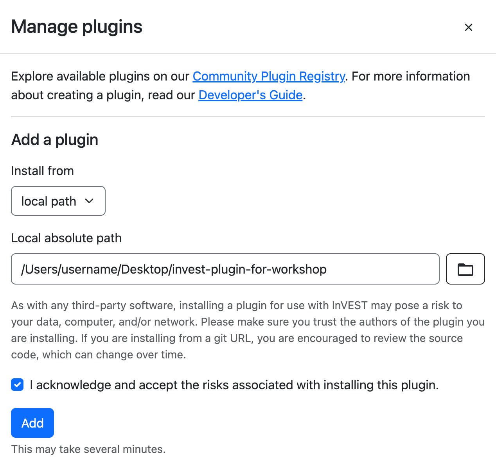

# Plugin Workshop Instructions

## Prerequisites
Before you begin, please make sure you have installed the following:
- the latest version of the [InVEST® Workbench](https://naturalcapitalalliance.stanford.edu/software/invest/invest-downloads-data#invest-workbench)
- [git](https://git-scm.com/install/)
- [conda or mamba](https://docs.conda.io/en/latest). `conda` comes with the "Miniconda" installer and `mamba` comes with the "Miniforge" installer. We recommend "Miniforge" if you don't already have a preference.

You may also want to have the following **optional** tools installed:
- your text editor of choice (VSCode, Sublime Text, Vim, etc.)

  Don't have a favorite text editor? No problem—most operating systems ship with a text editor you can use for this activity. Try `Notepad` or `Edit` on Windows, or `TextEdit` on macOS.

- [QGIS](https://qgis.org/)

## Phase 1: Set up a development environment
>[!NOTE]
>`conda` and `mamba` can be used interchangeably in the following commands, depending on which one you have installed.

**1. Establish a local directory for your project.**  
In this workshop, we will start by cloning this repository. If you were developing a plugin from scratch, you might start by creating a new directory and initializing a `git` repo there instead.

Open a shell/terminal and navigate to a directory where you wish to work. This command will create a new folder called "invest-plugin-for-workshop" and clone the repository's contents to it:
```
git clone https://github.com/natcap/invest-plugin-for-workshop.git
```

Check the contents of the folder:
```
cd invest-plugin-for-workshop
ls -lh
```

**2. Create a Python environment:**  
An InVEST Plugin is a Python package. All plugins use APIs from the `natcap.invest` Python library.
The first step in development is to create a Python environment and install `natcap.invest`.
The `-p` flag stands for "path", so the new environment will be contained within a folder called "env" within your current directory.
```
conda create -p ./env
```
Activate the environment so that all subsequent uses of `conda` and `python` use this environment.
```
conda activate ./env
```
Install the `natcap.invest` package and all its dependencies from conda-forge. Also install `pip`.
```
conda install -c conda-forge natcap.invest pip
```
Check if our environment is setup
```
python
>>> import natcap.invest
>>> exit()
```
In addition to the `natcap.invest` python API, we should also now have the `invest` command-line interface:
```
invest list
```
This lists all the available invest models. After we install a plugin, it will also be listed here!

## Phase 2: Develop a plugin and install it
For this workshop, we already have a plugin mostly developed and ready to use. Let's explore its contents to understand how it was developed.

**1. Open the invest-plugin-for-workshop folder in your text editor.**

- **pyproject.toml**:  
This file establishes the project as a Python package. As a plugin author, this is where you will define the other Python package dependencies that your plugin requires.

- **src/**:  
All of the plugin's source code is in this folder. Open `src/invest_plugin_for_workshop/plugin.py` in your text editor. All of the critical components that make this an "InVEST Plugin" are defined here:
  * `MODEL_SPEC` - an object that defines the model's inputs, outputs, and other metadata
  * `execute` - the function that is called when a user "runs" the model
  * `validate` - a function that checks if inputs are valid and provides feedback to users through the Workbench

- **Optional components**:  
The `pyproject.toml` and the plugin's source code together make this an "InVEST Plugin". But there are some optional components that plugins can also have:
  * sample data - contained in `sample_data` and referenced in `pyproject.toml` `[tool.setuptools.package-data]`
  * A reporter module for visualizing model results (`reporter.py`)

**2. Install the plugin into your active Python environment:**  
Make sure you are in the root `invest-plugin-for-workshop` directory (the one that contains `pyproject.toml`).
Use `pip` to install the package from its source code. The `-e` is for "editable", which means any edits you make to the source code will automatically update the installed package, without having to uninstall & re-install it. (Don't forget the `.`—it stands for the current directory, where `pip` will find the package we want to install)
```
pip install -e .
```
Check for success by opening a Python interpreter and importing the package:
```
python
>>> import invest_plugin_for_workshop
>>> exit()
```
InVEST should also recognize the package as a plugin:
```
invest list
```

## Phase 3: Test the plugin in the Workbench
We have confirmed that the plugin is a valid Python package by importing it in Python. And we confirmed that is a valid InVEST plugin/model by seeing it listed under `invest list`. But we still need to test if the user interface is working, and that the model runs. To do this, we will install our plugin into the InVEST Workbench, just like a plugin user would do.

1. Open the InVEST Workbench. Press the menu button in the upper-right corner of the window, then, from the list of options, select `Manage Plugins`.


2. In the `Manage plugins` modal, find the `Add a plugin` section.

In the `Install from` dropdown, select `local path`.

Then, press the `browse` button (with the folder icon) to locate the cloned repo using File Explorer (on Windows) or Finder (on macOS). Alternatively, you can type or paste the path to the cloned repo directly into the `Local absolute path` field.

Make sure the path ends with the name of the repo directory: `invest-plugin-for-workshop`.

>[!NOTE]
>The Workbench will use its own installation of `micromamba` to setup a Python environment for your plugin in much the same way we just did. If you wish, you may use the "Advanced" options to configure the Workbench to use the same `mamba` or `conda` package manager that you were using in the previous steps.

Read the disclaimer, check the checkbox, and then press the `Add` button.



3. Wait for installation to complete. The spinner will stop spinning, and you'll see a `Successfully installed plugin` message.


>[!TIP]
>After the plugin is installed, we can also configure the Workbench to run it using the Python environment you created earlier, rather than the environment that was just created by the Workbench. This will make it easier for you to make changes to the plugin source code and see them reflected in the Workbench. If you do not do this, you will need to uninstall and re-install the plugin in order to see changes reflected.

4. Close the `Manage plugins` modal. You should now see the `Birb Habitat` model listed in the Workbench, between `Annual Water Yield` and `Carbon Storage and Sequestration`, and labeled with a `Plugin` badge.


5. Select `Birb Habitat` to launch the plugin. Since this is the first time starting up this model, it may take a few minutes to load. Once it's done, you'll see a form with a few empty fields. These form fields are generated by the Workbench based on the inputs defined in the `MODEL_SPEC`.


6. Next, we'll provide the model inputs by completing the form. For each of these inputs, you can type into the form field directly, or use the `browse` button (labeled with a file folder icon) to navigate to a directory or a file.

- The `Workspace Directory` is entirely up to you. Choose any location on your computer where you would normally store files. If you want to create a new folder, select an existing location, then, in the form field, add a slash and the name of the folder you want to create. When the model runs, the folder will be created for you.

- For the `LULC`, select `invest-plugin-for-workshop/sample_data/LULC.tif`.

- For the `Biophysical Table`, select `invest-plugin-for-workshop/sample_data/biophysical_table.csv`.


7. Press the `Run` button to run the model.


8. Once the model has finished running, it's time to check out the results! Press the `Open Workspace` button to navigate to the workspace directory. Open `birb_habitat_report.html` in any web browser to explore the report. A report is a visual summary of a model run that provides a convenient way to quickly validate results without having to load them into a GIS program.


## Phase 4: Modify the model to aggregate results in an Area of Interest
1. Return to your code editor and open the plugin module ([src/invest_plugin_for_workshop/plugin.py](./src/invest_plugin_for_workshop/plugin.py)).

2. Search `plugin.py` for `Uncomment for Version 2`, and uncomment each section labeled with `Uncomment for Version 2`. As you uncomment each section, notice what this new code is adding to the model.
    
>[!TIP]
>In many text editors, you can select multiple lines of text, then press `Ctrl` + `/` (on Windows) or `⌘` + `/` (`Command-Slash`, on macOS) to comment/uncomment all those lines at once.

>[!NOTE]
>When commenting/uncommenting code, it's not uncommon to mistakenly comment/uncomment too few or too many lines, landing your code in an awkward "in-between" state. If at any point you find your code has become broken and you're not sure why, you can check the files in the `backups` folder in this repo. For example, if you're working on Version 2, take a look at `backups/version_2.py` for a complete copy of the Version 2 code—no commenting/uncommenting needed. You can use the "backup" code as a reference to debug your own, or if you're stuck, you can delete everything from `plugin.py` and then copy and paste the entire contents of `backups/version_2.py` into `plugin.py`.

3. Save your changes to `plugin.py`.

4. Quit and reopen the Workbench, then relaunch the `Birb Habitat` model. You'll notice an additional form field, `Area of Interest`. Use the `browse` button to select `invest-plugin-for-workshop/sample_data/AOI.shp`.


5. [Optional] You may want to choose a new workspace directory, if you'd like to be able to compare Phase 1 results side-by-side with Phase 2 results. For example, if you saved Phase 1 results to a folder called `birbs_phase_1`, you might choose to save Phase 2 results to a folder called `birbs_phase_2`.


6. Press the `Run` button to run the updated plugin. Once it's complete, press the `Open Workspace` button, open `birb_habitat_report.html`, and observe the results. What do you see that is new or different compared to the previous version?

> [!IMPORTANT]
> Quit and re-open the Workbench after editing source code in order to see your changes reflected.

## Phase 5: Modify the model to use birb population density data
1. Return to your code editor and open the plugin module ([src/invest_plugin_for_workshop/plugin.py](./src/invest_plugin_for_workshop/plugin.py)).

2. Search `plugin.py` for `Uncomment for Version 3`, and uncomment each section labeled with `Uncomment for Version 3`. As you uncomment each section, notice what this new code is adding to the model.

3. Save your changes to `plugin.py`.

4. Quit and reopen the Workbench, then relaunch the `Birb Habitat` model. You'll notice an additional form field, `Birb Population Density Table`. Use the `browse` button to select `invest-plugin-for-workshop/sample_data/birb_population_density_table.csv`.


5. [Optional] You may want to choose a new workspace directory, if you'd like to be able to compare Phase 1 and/or Phase 2 results side-by-side with Phase 3 results. For example, if you saved Phase 1 results to a folder called `birbs_phase_1`, you might choose to save Phase 2 results to a folder called `birbs_phase_3`.


6. Press the `Run` button to run the updated plugin. Once it's complete, press the `Open Workspace` button, open `birb_habitat_report.html`, and observe the results. What do you see that is new or different compared to the previous version?

## Phase 6 (Challenge Exercise)
Want to push the Birb Habitat model—and your skills—even further? See if you can follow these steps to **add support for an alternate LULC scenario**.

### Tips
- Some experience with Python and familiarity with geospatial data processing will give you a head start here, but they are not strictly necessary.
- A sample Alternate LULC is provided in the sample data. Feel free to use it to test your solution.
- If you get stuck, try looking at the [source code of core InVEST models](https://github.com/natcap/invest/tree/main/src/natcap/invest) for examples! For instance, the [Carbon Storage and Sequestration model](https://github.com/natcap/invest/blob/main/src/natcap/invest/carbon/carbon.py) generates a difference map when an alternate LULC is provided.

### Steps
1. Update the model to take an additional input:
    - **Alternate LULC** (raster, units: None): Land use/land cover raster under an alternate scenario.
2. Update the model to produce the following additional outputs:
    - **birb_count_alt.tif** (raster, units: None): Map of total number of birbs per pixel under an alternate LULC scenario.
    - **aggregated_results_alt.gpkg** (vector): Birb density statistics under an alternate LULC scenario, aggregated over each polygon in the Area of Interest vector.
3. Update the model to produce the following additional outputs:
    - **birb_count_increase.tif** (raster, units: None): Map of total number of birbs per pixel gained under an alternate LULC scenario, when compared to the baseline LULC scenario. A positive number indicates an increase in that pixel's birb population; a negative number indicates a decrease.
    - **[GROUP]\_count_increase.tif** (raster, units: None): Map of number of birbs (in a given birb group) per pixel gained under an alternate LULC scenario, when compared to the baseline LULC scenario. A positive number indicates an increase in that pixel's birb population; a negative number indicates a decrease. One raster is created for each birb group defined in the Birb Population Density Table.
4. Update the model reporter to include the new inputs and outputs:
    - **Alternate LULC**
    - **birb_count_alt.tif**
    - **aggregated_results_alt.gpkg**
    - **birb_count_increase.tif**
    - **[GROUP]\_count_increase.tif**

    How and where you add these items to the report is up to you—if you were trying to make sense of the model's results at a glance, how would you want to see them organized? If you're still not sure, or you'd like to see some examples, check out the [Sample Carbon Report](https://storage.googleapis.com/releases.naturalcapitalproject.org/invest-reports/latest/carbon_report_willamette.html) (for baseline/alternate results, a difference map, and an alternate LULC) and/or any of the other [Sample InVEST Reports](http://releases.naturalcapitalproject.org/?prefix=invest-reports/latest/) (for various ways to present vector results).

## Further Exploration
Ready to get started on your own plugin? The [InVEST Plugins Developer's Guide](https://invest.readthedocs.io/en/latest/plugins.html) is here to help!

Want to learn how to make your plugin discoverable by InVEST users—or just want to explore other published plugins? Check out the [InVEST Plugin Registry](https://natcap.github.io/invest-plugin-registry/).

Thanks for taking the time to learn about InVEST Plugins. We look forward to growing the InVEST open-source ecosystem with you!
